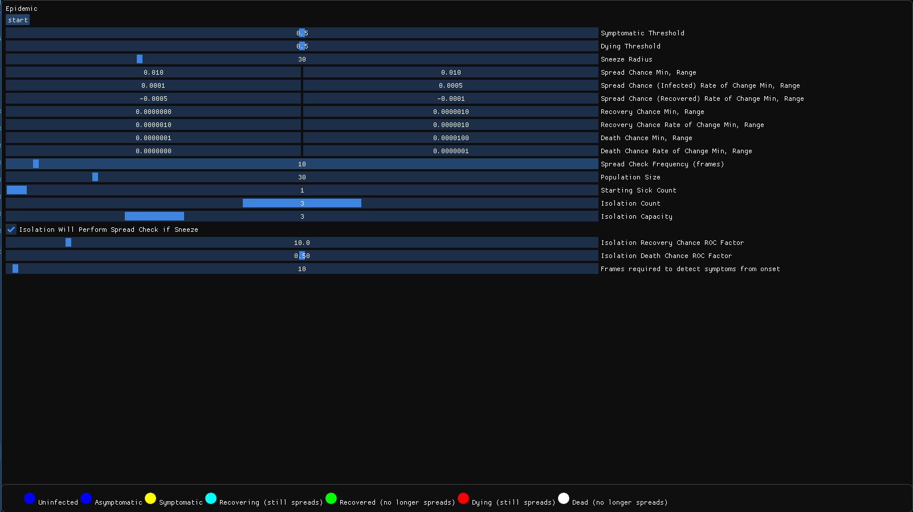
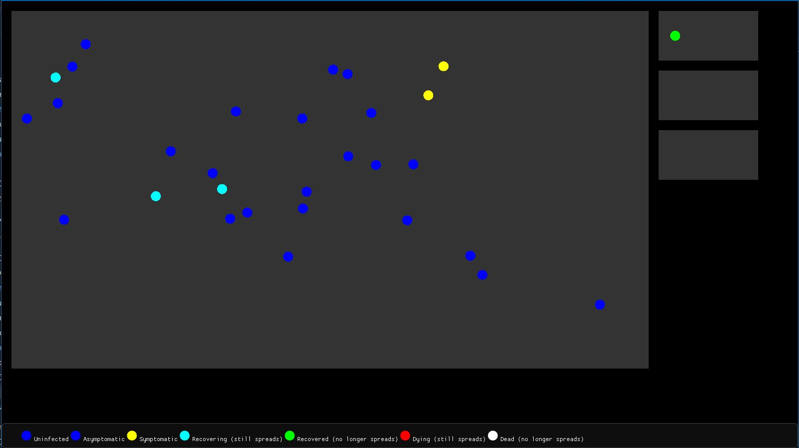

# Epidemic

## Brief

A simulation where the player acts as the government and tries to eradicate a disease outbreak.

## Screenshots

 

## For Players

Download the latest version [here](https://github.com/uiuc-fa20-cs126/final-project-toffeegryphon/releases).

## For Developers

### Dependencies

- [Visual Studio 2015](https://my.visualstudio.com/Downloads?q=visual%20studio%202015&wt.mc_id=o%7Emsft%7Evscom%7Eolder-downloads)
- [cmake](https://cmake.org/)
- [Cinder](https://www.libcinder.org/docs/index.html)
- [Cinder-ImGui](https://github.com/simongeilfus/Cinder-ImGui)
- [ImGui](https://github.com/ocornut/imgui)

### Getting Started

1. [Build](https://www.libcinder.org/docs/guides/cmake/cmake.html#building-libcinder-with-cmake) [Cinder](https://www.libcinder.org/docs/index.html)
2. `git clone` [Cinder-ImGui](https://github.com/simongeilfus/Cinder-ImGui) into `{CINDER_DIR}/blocks`
3. `git clone` [ImGui](https://github.com/ocornut/imgui) into `{CINDER_DIR}/blocks/Cinder-ImGui/lib`
4. Build with [CLion](https://www.jetbrains.com/help/clion/quick-cmake-tutorial.html), or,
   alternatively, [Visual Studio](https://docs.microsoft.com/en-us/cpp/build/cmake-projects-in-visual-studio?view=msvc-140)
   or command line:

``` console
> cd path\to\epidemic
> mkdir build
> cd build
> cmake -DCMAKE_BUILD_TYPE=Debug ..
```

## Gameplay

### Goal

To have the least number of infected, followed by recovered, followed by dead.

### Controls

|Key|Action|
|---|---|
|`Mouse Down`|Pick up Individual(s)|
|`Mouse Up`|Release Individuals(s)|
|`Mouse Drag` `Mouse Move`|Move currently held Individual(s)|

### Settings

|Property|Description|
|---|---|
|Symptomatic Threshold|Chance of Spread above which Individual will be rendered as Symptomatic
|Dying Threshold|Chance of Death above which Individual will be rendered as Dying
|Sneeze Radius|Pixel radius of spreading when an Individual sneezes
|Spread Chance Min, Range|Randomized chance of Infected Individual to sneeze and Spread, between `min` and `min + range`
|Spread Chance (Infected) Rate of Change Min, Range|Randomized rate of change of Spread chance per frame when Infected, between `min` and `min + range`
|Spread Chance (Recovered) Rate of Change Min, Range|Randomized rate of change of Spread chance per frame when Recovering, between `min` and `min + range`
|Recovery Chance Min, Range|Randomized chance of Recovery per frame, between `min` and `min + range`
|Recovery Chance Rate of Change Min, Range|Randomized rate of change of Recovery chance per frame, between `min` and `min + range`
|Death Chance Min, Range|Randomized chance of Death per frame, between `min` and `min + range`
|Death Chance Rate of Change Min, Range|Randomized rate of change of Death chance per frame, between `min` and `min + range`
|Spread Check Frequency|Number of frames between each global sneeze check
|Population Size|Total number of Individuals
|Starting Sick Count|Number of Individuals that start off as infected (Asymptomatic)
|Isolation Count|Number of Isolation wards
|Isolation Capacity|Number of Individuals per Isolation ward
|Isolation Will Perform Spread Check If Sneezes|Whether there is transmission between Individuals sharing a ward (if checked, tries to spread to all regardless of distance)
|Isolation Recovery Chance ROC Factor|`Recovery Chance += Factor * ROC` (usually `>1`)
|Isolation Death Chance ROC Factor|`Death Chance += Factor * ROC` (usually `<1`)
|Frames required to detect symptoms from onset|Frames since admission (if already infected) or first infection (if infected during stay in ward) before testing reveals Individual is infected. Sets Individual to Symptomatic regardless of spread chance.
